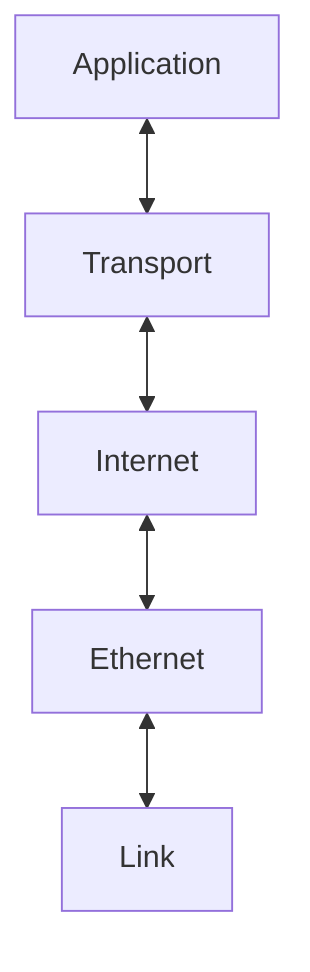

# 자바로 구현한 TCP/IP 4계층

## 1. 프로젝트 개요 (Project Overview)

### 목표: Java로 TCP/IP 4계층(네트워크 통신 구조)의 동작 원리를 직접 구현
기존에 하던 TCP/IP 구현 스터디가 중단 되었기 때문에 이어가고자 함
### 핵심 포인트: 계층별 데이터 처리, 캡슐화/역캡슐화, 패킷 파싱, 의존성 분리 구조 설계
### 기술 스택: Java 21, pcap4j, Concurrency API 
### 문서 
- [HOME](https://github.com/SeungminShin97/TCP-IP/wiki)
- [ADR](https://github.com/SeungminShin97/TCP-IP/wiki/ADR)
- Link Layer
- Ethernet Layer
- Internet Layer
- Transport Layer
- Application Layer

 

## 2. 구현 범위 (Implementation Scope)

|계층|주요 기능|상태|
|-|-|-|
|Link Layer          |패킷 캡처                                | 예정 |
|Ethernet Layer|MAC 헤더 파싱                            | 예정 |
|Internet Layer      |IP 헤더 파싱, Fragment 재조립             | 예정 |
|Transport Layer     |TCP/UDP 기본 헤더 구조, Port 기반 연결 관리 | 예정 |
|Application Layer   |		| 예정 |

 

## 3. 구조 설계 (Architecture)

- 계층 간 양방향 체인 구조 (상,하 의존성 주입)
- 각 Layer는 receive() / send() 메서드로 연결
- 패킷 캡슐화 흐름: Application → Transport → Internet → Ethernet → Link
- 패킷 역캡슐화 흐름: Link → Ethernet → Internet → Transport → Application
- 다이어그램 :

 

## 4. 이전 스터디 링크 (Previous Work)

[📚 TCP/IP 4계층 구현 스터디 기록 보기](https://github.com/Software-development-methodology)

 

<!--
## 5. 향후 계획 (Next Steps)

Transport Layer 완성 (TCP 3-way handshake 구조 실습)
패킷 송수신 GUI 시뮬레이터 (패킷 시각화)
테스트 자동화 및 pcap 파일 기반 단위 테스트

6. 참고 자료 (References)

RFC 791, RFC 793
pcap4j 공식 문서
《TCP/IP Illustrated》 Vol.1
-->
